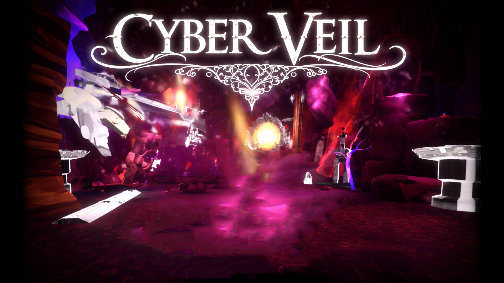

<p align="center">
  A cyber-medieval third-person action game built with Unity.
</p>



## About CyberVeil

CyberVeil is a stylized action game set in a fractured cyber-medieval world. Fight through enemy waves, adapt to trial curses, cleanse the portal, choose upgrades, and push through three increasingly dangerous levels.

The game combines fast melee combat with a low-poly fantasy world, neon corruption, magical technology, cinematic transitions, and a shard-based archive home screen.

## Why I Made It

About a year ago, I wanted to start my first coding project. Making a game sounded like the most fun way to learn, so I began building CyberVeil.

What started as a first project became something I put a lot of passion into. Along the way, I learned far more than how to write individual scripts: I learned how to organize a growing codebase, separate responsibilities, debug interactions between systems, work with state and events, iterate on game feel, and make technical decisions without losing sight of the player experience.

CyberVeil is still evolving, but it represents a year of learning, experimentation, and care.

## Features

- Responsive camera-relative movement, sprinting, and blink-style dashing
- Three-hit light attack combo and a charged heavy attack
- Veil Surge ability that temporarily accelerates combat and bypasses attack locking
- Enemy state machines with patrol, chase, melee, charge, leap, shield, and projectile behaviors
- Configurable enemy waves, spawn groups, and level progression
- Trial curses that modify encounters
- Portal-based upgrades and persistent player stat improvements
- Three playable level scenes connected by cinematic fades
- Hit stop, screen shake, dissolve effects, particles, combat audio, and damage feedback
- Animated shard archive home screen with keyboard and mouse navigation
- In-game tutorial, interaction prompts, dialogue, settings, and death/restart flow

## Controls

| Input | Action |
| --- | --- |
| `W` `A` `S` `D` | Move |
| Mouse | Look around |
| Left mouse button | Light attack / continue combo |
| Hold and release right mouse button | Charge and release a heavy attack |
| `Space` | Blink / dash |
| Left `Shift` | Start a timed sprint |
| `X` | Activate Veil Surge when ready |
| `E` | Interact with nearby characters, crystals, and portals |
| `Z` | Restart after death |

The home screen supports the mouse, arrow keys or `W`/`S`, `Enter` to confirm, and `Escape` to go back.

## Getting Started

### Requirements

- [Unity Hub](https://unity.com/download)
- Unity `6000.0.26f1`
- Git, used by Unity Package Manager to resolve the Unity MCP development package

### Run the project

1. Clone the repository:

   ```bash
   git clone https://github.com/umarazizadah/CyberVeil.git
   ```

2. Add the cloned folder as a project in Unity Hub.
3. Open it with Unity `6000.0.26f1` and allow Unity to import the assets and restore packages.
4. Open `Assets/Scenes/CyberVeil_HomeScreen.unity`.
5. Enter Play Mode.

The enabled build sequence is:

1. `CyberVeil_HomeScreen`
2. `CyberVeil_Level1`
3. `CyberVeil_Level2`
4. `CyberVeil_Level3`

## Project Structure

```text
Assets/
|-- Art/                    Models, materials, animations, shaders, and UI art
|-- Audio/                  Music and sound effects
|-- Scenes/                 Home screen and playable levels
`-- Scripts/
    |-- Audio/              Audio feedback components
    |-- Combat/             Damage, health, knockback, and combat coordination
    |-- Core/               Shared interfaces and character state infrastructure
    |-- Enemies/            Enemy AI, attacks, and damage responses
    |-- Player Scripts/     Movement, attacks, abilities, and player progression
    |-- Systems/            Waves, curses, scene flow, cameras, audio, and feedback
    |-- UI/                 Menus, tutorials, dialogue, HUD, and shard archive
    |-- VFX/                Dissolves, particles, and hit effects
    `-- World/              NPCs, crystals, portals, and interaction components
```

## Technical Highlights

- State-driven player and enemy behavior
- Interface-based damage, interaction, attack, knockback, sound, and visual-response contracts
- Event-driven wave, tutorial, curse, and upgrade flow
- Scene-persistent progression and fade management
- Data-configurable encounters and stat upgrades
- Coroutine-driven attacks, VFX, cinematics, UI animation, and scene transitions
- Unity Input System alongside focused legacy-input integrations
- Universal Render Pipeline, Shader Graph, Visual Effect Graph, and AI Navigation

## Project Status

CyberVeil is a personal learning project and a work in progress. Systems, balance, presentation, and content may continue to change as the game develops.

## License and Assets

No project-wide license has been added yet. The repository also contains third-party Unity packages and art assets; their respective rights remain with their original creators.
